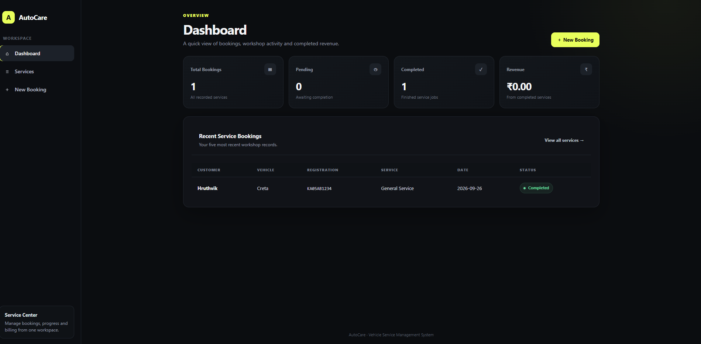
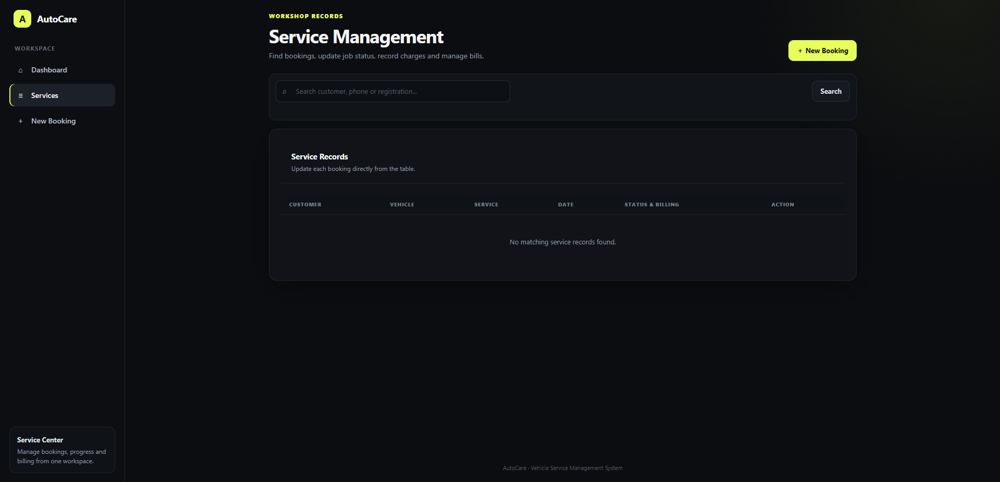
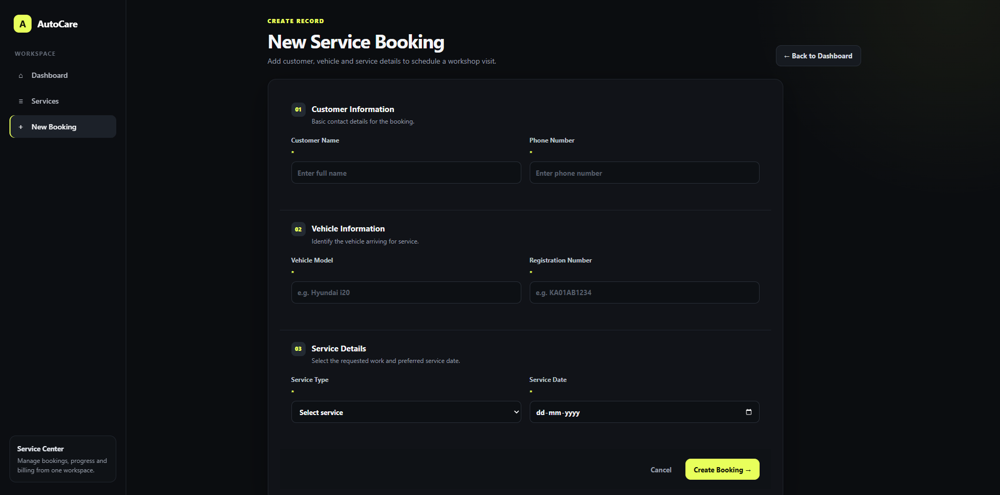

# VEHICLE SERVICE MANAGEMENT SYSTEM (AUTOCARE)

**Project README / Reference Document**

## Vehicle Service Management System

A web-based Vehicle Service Management System developed using Python, Flask, SQLite, HTML5, CSS3, and JavaScript. The application helps automobile workshops manage customer service bookings, track job status and billing, and store completion bills, through a simple web interface.

The system records each service booking, tracks it through Pending, In Progress and Completed states, calculates workshop revenue from completed jobs, and allows a bill file to be attached once a job is finished.

---

## Features

- Service Booking Creation
- Customer and Vehicle Detail Capture
- Service Type Selection
- Service Status Tracking (Pending / In Progress / Completed)
- Billing Amount Recording
- Dashboard Summary Cards (Total, Pending, Completed, Revenue)
- Recent Bookings Overview
- Search by Customer, Phone or Registration Number
- Bill Upload After Service Completion
- Bill Replacement (Old Bill Removed Automatically)
- Bill Viewing / Download
- Service Record Deletion (With Linked Bill Cleanup)
- Upload File Type Validation (PDF, JPG, JPEG, PNG, WEBP)
- Upload File Size Limit
- Persistent SQLite Database Storage
- Auto-Dismissing Flash Notifications
- Dark-Themed Professional Web Interface

---

## Tech Stack

### Frontend

- HTML5
- CSS3
- JavaScript
- Jinja2 Templates

### Backend

- Python
- Flask

### Database

- SQLite

### File Storage

- Local filesystem storage for uploaded bill files (PDF / image formats)

---

## Project Structure

```text
vehicle_service/
│── app.py
│── requirements.txt
│── README.md
│── .python-version
│
├── database.db                   # Created locally at runtime
│
├── static/
│   ├── script.js
│   └── style.css
│
├── templates/
│   ├── base.html
│   ├── index.html
│   ├── add_service.html
│   └── services.html
│
└── uploads/
    └── (uploaded bill files stored here at runtime)
```

---

## Database Table

The system uses a single SQLite table to store all service booking data.

### Services Table

| Field | Description |
|---|---|
| id | Auto-generated unique service booking identifier |
| customer | Customer name |
| phone | Customer phone number |
| vehicle | Vehicle model |
| reg_no | Vehicle registration number |
| service_type | Type of service requested (e.g. Oil Change, Engine Repair) |
| service_date | Scheduled / booked service date |
| status | Current job status: Pending, In Progress, or Completed |
| amount | Billed amount, recorded once work is priced |
| bill_file | Filename of the uploaded bill, once one exists |

Each row represents one workshop visit for one vehicle, from booking through to completed billing.

---

## Application Logic and Rules

Before data is saved or a bill is accepted, the application checks the submitted values:

- Customer, phone, vehicle, registration number, service type and service date are all required to create a booking.
- Service date defaults to, and cannot be set before, the current date on the booking form.
- Status updates are restricted to Pending, In Progress, or Completed — any other value is rejected.
- Billed amount must be a valid, non-negative number.
- A bill can only be uploaded once a service's status is Completed.
- Uploaded bills are restricted to PDF, JPG, JPEG, PNG or WEBP files, and to a maximum size of 10 MB.
- Uploaded filenames are sanitized and renamed to a unique, unguessable name before being stored.
- Replacing a bill removes the previously stored bill file from disk.
- Deleting a service record also removes its associated bill file, if one exists.
- Dashboard totals (total bookings, pending, completed, revenue) are recalculated from the current data on every visit.
- The search box filters records by matching against customer name, registration number, or phone number.

---

## Application Workflow

1. Open the Dashboard to view booking totals and recent activity.
2. Create a New Booking with customer, vehicle and service details.
3. View All Services on the Service Management page.
4. Search or Filter Records by customer, phone, or registration number.
5. Update Job Status as work progresses (Pending → In Progress → Completed).
6. Record the Billed Amount once the job is priced.
7. Upload the Bill once the service is marked Completed.
8. View or Replace the Bill as needed.
9. Delete a Service Record when it is no longer needed.

---

## Working Flow

```text
New Service Booking
(Customer + Vehicle + Service Type + Date)
   ↓
Service Record Stored in SQLite
   ↓
Status Tracking
(Pending → In Progress → Completed)
   ↓
Billing
(Amount Entered on Completion)
   ↓
Bill Upload
(Allowed only after status = Completed)
   ↓
Bill Stored on Filesystem + Linked in Database
   ↓
Dashboard Summary
(Total / Pending / Completed / Revenue)
   ↓
Search / View / Update / Delete
```

---

## User Interface

The application interface includes:

- Dashboard
- Summary Cards (Total, Pending, Completed, Revenue)
- Recent Bookings Table
- New Booking Form
- Service Management Table
- Search Box
- Inline Status and Amount Update Controls
- Bill Upload / Replace Controls
- Bill View Link
- Delete Confirmation Prompt
- Auto-Dismissing Flash Messages
- Dark-Themed Professional Layout

---

## Security and Data Integrity

The application includes several measures to protect data consistency:

- Server-side validation of required booking fields
- Restricted, whitelisted set of allowed statuses
- Non-negative amount validation
- Restricted file extensions for bill uploads
- Maximum upload size enforcement (10 MB) with a friendly error message
- Filename sanitization via `secure_filename`
- Unique, randomized stored filenames to avoid collisions and guessing
- Automatic removal of orphaned bill files on replacement or deletion
- SQLite storage with row-factory access for readable query results

---

## Installation

### 1. Extract / Clone the Project

```bash
git clone <your-repository-url>
cd vehicle_service
```

### 2. Create a Virtual Environment

```bash
python3 -m venv .venv
```

### 3. Activate the Virtual Environment

#### Linux / macOS

```bash
source .venv/bin/activate
```

#### Windows

```bash
.venv\Scripts\activate
```

### 4. Install Dependencies

```bash
pip install -r requirements.txt
```

The current Python dependency is:

```text
Flask
```

### 5. Run the Application

```bash
python app.py
```

### 6. Open the Application

Open the local Flask address shown in the terminal, normally:

```text
http://127.0.0.1:5000/
```

The SQLite database and required table are initialized automatically when the application starts.

---

## Screenshots

> Add screenshots of the Dashboard, Service Management page, and New Booking form to a `screenshots/` folder, then reference them below.







---

## Future Enhancements

- User Login and Authentication
- Owner / Staff Roles
- Customer Self-Service Portal
- SMS / Email Service Reminders
- Vehicle Service History Lookup by Registration Number
- Spare Parts and Inventory Tracking
- Invoice Generation (PDF Export)
- Multiple Bill Attachments per Service
- Payment Status and Partial Payments
- Reports and Analytics Dashboard
- REST API Support
- Cloud Database Deployment

---

## Learning Outcomes

- Python programming
- Flask web application development
- SQLite database design
- HTML and CSS
- JavaScript
- Jinja2 templating
- CRUD operations
- Form validation
- File upload handling and validation
- Server-side business rule enforcement
- Full-stack web application development

---

## Author

**Project:** Vehicle Service Management System (AutoCare)

**Technologies:**
Python | Flask | SQLite | HTML | CSS | JavaScript | Jinja2

---

## GitHub

<your-repository-url>

---

## License

This project is developed for educational, academic, internship, and portfolio purposes.
